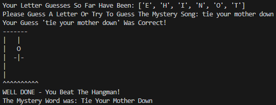
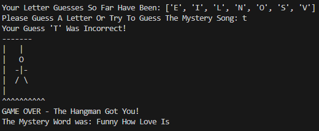

# Queen Hangman

Queen Hangman is a text-based terminal game where the objective is to correctly guess a hidden song by letter or by a word guess, before a stick figure representing the "hanged man" is fully drawn.

## Screenshots
### Winning Screen

### Losing Screen

### Technology Stack
- **Python**

### Dependenices
- None

### Installation
1. Clone this repo:  
   `git clone https://github.com/dotnickcore/queen-hangman.git`
2. Run the app:
   `py app.py`

## License
MIT License

Copyright (c) [2026] [dotnickcore]

Permission is hereby granted, free of charge, to any person obtaining a copy
of this software and associated documentation files (the "Software"), to deal
in the Software without restriction, including without limitation the rights
to use, copy, modify, merge, publish, distribute, sublicense, and/or sell
copies of the Software, and to permit persons to whom the Software is
furnished to do so, subject to the following conditions:

The above copyright notice and this permission notice shall
